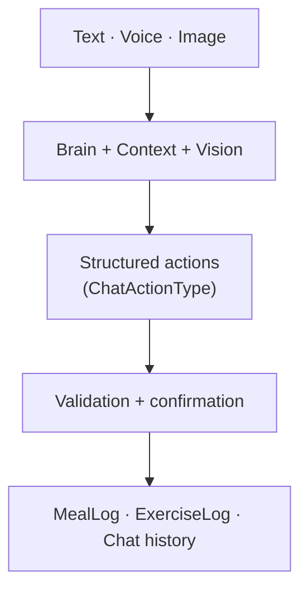

> Code available at [github.com/jgorostegui/fitness-copilot](https://github.com/jgorostegui/fitness-copilot).

## Inspiration

What if you could snap a photo of your meal or workout and get instant, context-aware feedback? Not just "that's 500 calories" but "you've got 600 left for today, and your leg workout is still pending."

The inspiration came from wanting to build something ambitious, something that stitches together incompatible systems and makes them cooperate. With proper guardrails, spec-driven development, and tight steering docs, this entire project was built in a day and a half.

## What it does

Fitness Copilot is an AI-powered fitness tracking app that combines:

- **Vision-based logging**: Snap a photo of your meal or exercise, and Google Gemini Vision analyzes it
- **Voice input**: Speak your logs instead of typing, with browser-native Web Speech API and no backend changes needed
- **Context-aware coaching**: The AI knows your training plan, today's progress, and recent conversation before responding
- **Validated tracking**: All nutrition and exercise data is validated before hitting the database
- **Dual interface**:
  - **Monitor**: A _typical_ dashboard for tracking metrics.
  - **Chat**: An interactive chat interface for text, voice, and image input.

The system doesn't just track. It understands your full situation and provides personalized guidance.

## How We Built It

### Product Discovery

Prior to the spec-driven stage, and in parallel to building the guardrails, several interactions with **Google Gemini AI Studio** were paramount to decide which features are in/out for the MVP.

Working on a Codex/Gemini-like UI/UX interface lets you focus on the frontend and do what I'd call a **product discovery stage**. This can be done in Kiro too, but AI Studio is a delightful way to do it and works really well for early exploration.

### Guardrails: Starting with a Strong Foundation

It's important to have good guardrails. The **fullstack FastAPI template** helped a lot. In this sense:

- Having a **README.md** helps the developer understand the project
- **Steering commands** from Kiro are very useful so the interaction from the LLM and the human are as similar as possible
- Having a polished **task runner file** (`justfile` in our case, but anything can fit here) for the project has been very useful

Even when following SDD, some drifts appear (software engineering, in a nutshell). It's important that after each slice, you test thoroughly before moving on.

### Steering: Teaching Kiro the Constraints

We used **tight steering docs**, inspired by Kiro's "[Stop Repeating Yourself](https://kiro.dev/blog/stop-repeating-yourself/)" blog post and by the `/reflect` and `/verify` patterns popular in the SDD ecosystem.

Steering documents tell Kiro not just what to build, but what NOT to build. They encode architectural decisions as rules:

- "CSV plans are immutable"
- "All calories must be validated"
- "Exercise names must come from an allowed list"

### Spec-Driven Development: The Core Workflow

Every major capability in the app has:

- A **requirements spec** in `.kiro/specs/...`
- Optional design notes
- A clear mapping to tests or acceptance criteria

The FastAPI + React code is consistently generated or refactored under those specs:

- Backend routes mirror spec sections
- Frontend types are derived from OpenAPI
- The Update DSL is treated as a first-class contract

This structure ensures that before writing any code, you know exactly what "done" looks like. The specs become the source of truth, and Kiro generates implementations that match them.

### Agent Hooks: Automation with a Twist

We utilized **Agent Hooks** to validate the stitching between Frontend types and Backend models, automatically updating documentation whenever the schema changed.

I found that different hooks work better at different times. Automatic hooks are great for catching drift early, while manual hooks (like `fix-lint`) work well for heavier validations when you're ready to wrap up a feature. The key is matching the hook type to the task.

## The Architecture

*Multimodal inputs become typed actions, validated before they reach state. Full system diagrams (chat, vision, voice, context building) in [ARCHITECTURE.md](https://github.com/jgorostegui/fitness-copilot/blob/main/ARCHITECTURE.md).*

What makes this work is how we stitched together incompatible systems:

- **AI Vision** (flexible estimation) → **Pydantic Validation** (enforces schema & ranges) → **PostgreSQL** (stores structured data)
- **Natural language input** → **Two-tier parser** (keyword matching + LLM fallback) → **Structured logs**
- **Chat** (adaptive, conversational) ↔ **Monitor Dashboard** (rigid, mathematical)

The key innovation is **context injection**: before every AI request, we inject the user's training plan, today's progress, and recent conversation. The AI doesn't just see a photo. It understands the full situation.

## Next Steps

Future work to make this production-ready:

- Polish the initial user setup flow.
- Remove hard-coded paths (many, lol).
- Make it more robust against edge cases.
- Improve context engineering to make responses even better.
- Add streaming for video and audio responses.
- Leverage AI assistant for any training/nutrition questions.

Long term research:

- **Context handling and memory**: Explore cutting-edge LLM research on long-term memory and context management. Current approaches like RAG (Retrieval-Augmented Generation) and memory-augmented transformers could enable the assistant to remember patterns across weeks or months, not just the last 10 messages. Papers like [MemGPT](https://memgpt.ai/) and Google's [Infini-attention](https://arxiv.org/abs/2404.07143) show promising directions for unbounded context windows.
- **Personalized embeddings**: Build user-specific embeddings from historical data to capture individual preferences, meal timing patterns, and workout recovery needs without explicit rules.
- **Agentic workflows**: Move from single-turn responses to multi-step reasoning where the assistant can plan, execute, and verify actions autonomously (e.g., "adjust my meal plan for the week based on yesterday's workout intensity").

## Learnings from Using Kiro

Working with Kiro on this project taught me a lot about effective AI-assisted development:

- **Finding the right hook timing**: Automatic hooks are great for catching issues early, but during rapid iteration I sometimes wanted to defer validation until I was ready. I ended up using a mix: automatic for critical checks, manual for heavier validations like linting entire features. The flexibility to choose is what matters.

- **Spec drift needs active management**: Even with tight specs, implementation drifts. Kiro generates what the spec says, but as you iterate, small changes accumulate. The fix? Test after every slice, not at the end. Kiro's spec-driven approach makes this easier because you have a clear "done" definition to test against.

- **Steering docs compound over time**: The more constraints I encoded in steering docs, the less I had to repeat myself. Early on, I was constantly reminding Kiro about validation rules. By the end, the steering docs handled it automatically. The investment pays off.

- **Context engineering is its own skill**: Building the right context for LLM calls (what to include, what to exclude, how to structure it) is a discipline. Kiro's specs helped me think through this systematically rather than ad-hoc.

## Key Takeaways

1. **SDD makes ambitious projects shippable**.
2. **Product discovery** (AI Studio) → **Guardrails** (templates) → **Implementation** (specs + Kiro)
3. **Steering docs** prevent repeated mistakes by teaching constraints
4. **Hooks work best when you choose the right timing** for each task
5. **Context injection** is what makes AI feel alive and personalized

## References

- [Martin Fowler: Spec-Driven Development with AI Tools](https://martinfowler.com/articles/exploring-gen-ai/sdd-3-tools.html)
- [Kiro Blog: Stop Repeating Yourself](https://kiro.dev/blog/stop-repeating-yourself/)

## Demo Video

- [Fitness Copilot Demo Video](https://www.youtube.com/watch?v=nlwR8h1CgtE)

---

*Built for [Kiroween 2025](https://devpost.com/software/fitness-copilot)*
