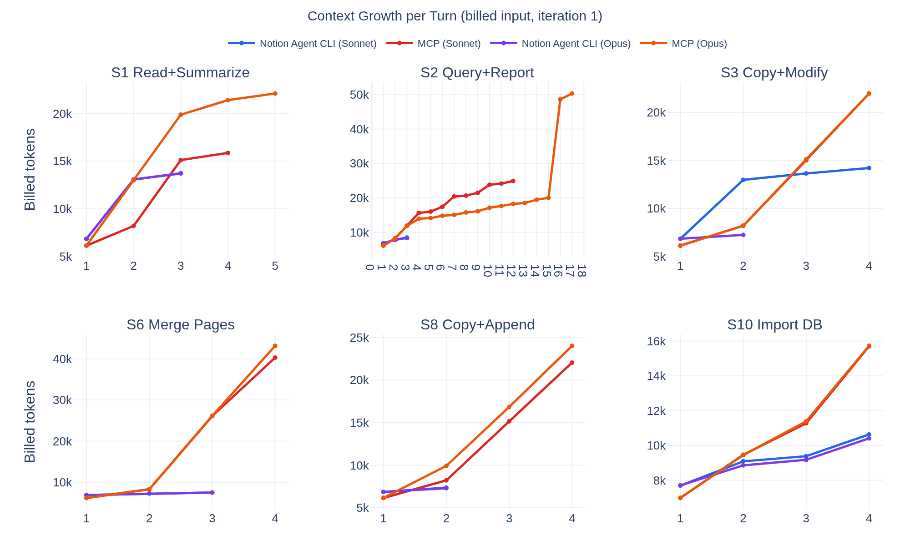
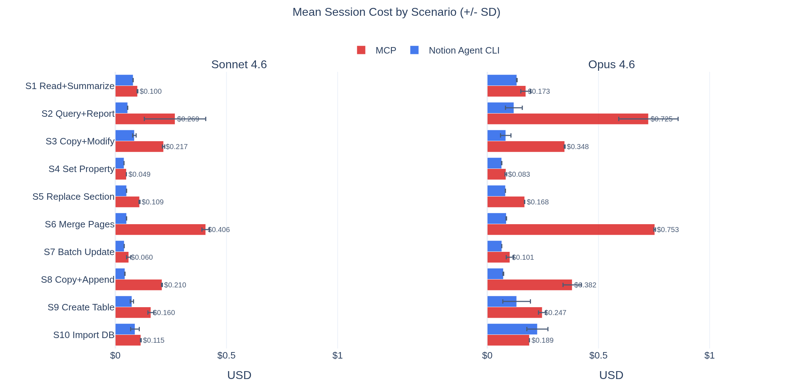

Most useful agent workflows start the same way: connect the model to the systems where the work already lives. In practice, that often means [MCP](https://modelcontextprotocol.io/docs/getting-started/intro): the service exposes tools, the agent calls them, and the results stay in the conversation while the model decides what to do next.

Claude Code can already reach Notion through the official [Notion MCP](https://developers.notion.com/guides/mcp/mcp). It can read pages, query databases, and create content. But in practice, the model routinely **spends more turns coordinating lower-level operations** than doing the work the user asked for.

So I built [Notion Agent CLI](https://github.com/jgorostegui/notion-agent-cli), a client-side task-level interface over the same Notion API, and benchmarked it against the official MCP path across different Claude Code tasks. The benchmark asks whether codifying repeated workflows into actions reduces turns, context replay, and cost compared with having the model assemble those workflows inside the conversation.

Across 200 benchmark sessions, the task-level interface reduced mean turns from 6.5 to 2.8 and reported cost from \$24.31 to \$8.33.

## The granularity mismatch

A typical user request like "query this database and write a report" sounds like one task. Under a broad tool surface, it can become a live orchestration problem: inspect the database shape, find the rows, fetch entries, decide which properties matter, normalize the results, shape the report, and write it back.

None of those steps is irrational. The model is doing what the interface asks of it. But every step creates another decision, another tool result, and another piece of intermediate state that later turns have to carry forward.

The mismatch is not that the API is missing capability. It is that the available operations are shaped like implementation details while the user request is shaped like a workflow. The model can bridge that gap, but it has to do so inside the session.

That is where the cost showed up. My tasks were narrower than the interface: query this database and write a report, copy this page and change one section, merge these pages into a summary. When those tasks did not map cleanly to one operation, the model became the workflow engine.

## What I built

I started with Notion's official [JavaScript SDK](https://github.com/makenotion/notion-sdk-js) and [API](https://developers.notion.com/reference/intro), wrapping the endpoints Claude needed most: pages, blocks, databases, search. The plugin converts to and from markdown on both reads and writes. That made tool results smaller and write payloads simpler, but it did not solve the coordination problem.

Consider what it takes to copy a Notion page and add a new section. Through the API: read the source page content, paginate child blocks when needed, convert the content to markdown, create the target page, and append any overflow in 100-block chunks. The exact API-call count depends on page size and nesting.

The plugin turns that workflow into one agent-visible call: `copyPageWith`. The same pattern applies across the interface: pagination, result shaping, chunking, and read-modify-write coordination move into code, so the model does not have to rebuild those workflows inside the conversation.

Adding a new compound action means adding a method plus registry metadata; the CLI schema and generated skill docs then pick it up without restructuring.

## Why this matters

In Anthropic's [context engineering cookbook](https://platform.claude.com/cookbook/tool-use-context-engineering-context-engineering-tools), a baseline long-running research agent ended with file-read tool results making up 96.3% of the final context. The exact workload is different, but the mechanism is the same: tool output accumulates, and later turns pay to carry it forward.

That is why turns and cost are not proportional. A 6-turn session does not cost 3x a 2-turn session. Later turns include the accumulated tool output, intermediate state, and prior decisions from earlier turns.

A tool result is not paid for once. If a fetch pulls rows, schema details, metadata, and intermediate state into the conversation, the next turn carries that output forward, and the turn after that carries it again. Reducing turns matters because it removes both the extra decisions and the replay of the state created by those decisions.

Anthropic's ["Code execution with MCP"](https://www.anthropic.com/engineering/code-execution-with-mcp) makes a related execution-layer argument. Presenting MCP tools as code files lets the agent discover only the definitions it needs instead of loading every connected tool upfront; in their example, that reduced tool-definition context from 150,000 tokens to 2,000. The same execution layer can also filter large tool results before they enter the model's context.

That is the useful principle here: the model should receive the task-shaped result, not the whole path taken to produce it. If code can do the filtering, pagination, joining, validation, or retry logic deterministically, that work should not be replayed through the model's context unless the model actually needs to see it.

That accumulated replay is what I mean by context drag. If a workflow can return a compact task-shaped result instead of exposing every intermediate step to the conversation, it reduces both the current payload and the context every later turn has to process.

## The experiment

To measure the difference in practice, I built a controlled benchmark comparing the two interfaces head to head. The full methodology, caveats, and artifacts are in the repository's [evaluation write-up](https://github.com/jgorostegui/notion-agent-cli/blob/main/EVALUATION.md).

The benchmark covered 10 typical Notion workflows across Claude Sonnet 4.6 and Claude Opus 4.6. Each scenario ran five times per condition, with isolated environments, fixture resets, and automated validation, producing 200 sessions that passed the benchmark validators.

Two design choices are worth mentioning. First, this was not a discovery benchmark. The MCP condition used Claude Code's native MCP tool surface. To make the client-side condition comparable, I gave the model the relevant CLI usage instructions at session start instead of measuring whether it would discover the interface on its own. In the terms used by Liu et al. in [*How Well Do Agentic Skills Work in the Wild*](https://arxiv.org/abs/2604.04323), this is closer to a force-loaded curated-skill setting than a retrieval or selection setting. Second, each condition was constrained to its assigned interface: MCP sessions used Notion MCP tools, while Notion Agent CLI sessions used the CLI. Together, those choices keep the comparison focused on interface efficiency: once the model knows which interface to use, how expensive is that interface?

## The same task, twice

One benchmark scenario asked the agent to query a Notion database and create a report page listing the entries. The database entries included fields like status, priority, category, and description, but the task itself was simple: get the rows, then write the report.

Across the five Opus runs for this scenario, the MCP path averaged 32.8 turns and \$0.725. Notion Agent CLI averaged 4.0 turns and \$0.119.

The MCP runs showed a consistent pattern. The agent had to discover an enumeration strategy through the available operations. In the clearest trace, it fetched the database, searched repeatedly across categories, priorities, project themes, and department keywords, then fetched matched rows one by one before creating the report page.

The model was doing reasonable work with the interface it had. The problem is that enumeration became a live workflow inside the conversation. Each search and fetch added another decision, another tool result, and another piece of intermediate state that later turns had to carry forward.

The paired client-side run took two steps. The plugin returned the database rows as a compact table, and the model wrote the report directly from it. In that pair: 3 turns and \$0.095, against 31 turns and \$0.667 on the MCP side.

That is the benchmark in miniature. One interface had an operation that matched the task. The other required the model to assemble the workflow live.

When the primitive matches the task, the model calls it and moves on. When it does not, the model rebuilds the missing operation from the tools it has, inside the session, with all intermediate output carried forward. The cost of that reconstruction is what the benchmark measured.

*Figure 1. Cumulative billed input tokens for selected benchmark scenarios, using iteration 1. The MCP path grows faster when it requires more turns and carries more intermediate tool output forward.*

## Results

| Model | Notion Agent CLI avg turns | MCP avg turns | Notion Agent CLI total cost | MCP total cost | Saving |
|---|---:|---:|---:|---:|---:|
| Sonnet 4.6 | 2.6 | 5.5 | \$3.03 | \$8.47 | 64% |
| Opus 4.6 | 2.9 | 7.4 | \$5.30 | \$15.84 | 67% |

Mean turns fell from 6.5 to 2.8. Total cost fell from \$24.31 to \$8.33.

*Figure 2. Mean session cost by scenario across Sonnet 4.6 and Opus 4.6. The widest gaps appear when the MCP path forces the model into longer, lower-level workflows.*

The largest gains showed up on compound tasks: "query a database and write a report" and "merge three pages into one." These are exactly the scenarios where the MCP path forces the model into longer chains of lower-level operations with large intermediate results.

The advantage was not uniform. With Opus, creating a Notion database from a markdown table was the one scenario where Notion Agent CLI was more expensive: \$0.225 vs \$0.189 for MCP, with more turns (5.6 vs 4.0). The MCP path was notably consistent here, completing in exactly 4 turns across all five runs. I did not expect the same compound action to be cheaper with Sonnet than with Opus. This needs further investigation.

This matters because it draws the real boundary. A higher-level interface does not help automatically. The advantage depends on the task being complex enough that the low-level path forces the model into a longer chain. When the task is already short, you pay for the abstraction without getting the payoff.

## When the workflow becomes an artifact

The important move was not just making output more compact. It was turning a procedure the model would otherwise rediscover into a durable artifact: code that can paginate, shape results, preserve structure, apply read-modify-write edits, and return a task-shaped answer. Once that workflow is encoded and verified, the model calls it again instead of rebuilding the recipe inside every session.

That is the part of the ARC Prize 2025 work that felt relevant to me. [Guillermo Barbadillo](https://ironbar.github.io/arc25/05_Solution_Summary) is the cleanest analogy: he argues for program synthesis because code is verifiable, checked against examples, refined from execution feedback, and run by a deterministic interpreter once the right program is found. [NVARC](https://drive.google.com/file/d/1vkEluaaJTzaZiJL69TkZovJUkPSDH5Xc/view) makes the same move on the representation and training side. Sorokin and Puget compress the problem into a compact grid format, 3.2M synthetic training samples, and a workflow tuned to Kaggle's compute limits, surpassing submissions that cost 40 times more. One tightens the operation space, the other the representation. In both cases the work is encoded once and reused, not reconstructed in every session.

That is the same move here, at a different layer. I did not control Notion's hosted MCP server or Claude Code's execution layer, so the lever I had was the interface I gave the model. Notion Agent CLI turns recurring Notion procedures into reusable operations. "Read all rows," "copy this page and patch one section," and "merge these pages into a summary" each become one call with implementation behind it, not a workflow for the model to rediscover.

The 66% reduction is a measurement of that shift. I did not change the model, the Notion API, or the hosted MCP server. I changed where the repeated work lived. Instead of asking the model to reconstruct the same pagination, conversion, and update logic in every run, I moved that logic into verified client-side operations the model could reuse. The lesson is not that every task needs a custom tool. It is that repeated, checkable procedures should graduate out of the conversation and into code.

## Honest limits

Several things constrain how far these results should travel.

The client-side condition measures the best-case path: the model already knows the interface. It does not measure whether the interface would be discovered, selected, or adapted correctly in a larger tool ecosystem.

The Notion Agent CLI condition also had its own friction. The benchmark used Bash calls to a Node script because that was the local execution surface available in Claude Code. The rough edges clustered around table and database creation, where large inline payloads and command construction led to repeated retries. A typed library or code-execution layer could keep the same high-level operations while giving the model structured inputs and outputs, safer permissions, and less shell quoting.

Custom abstractions are not free. They trade model work for engineering work: someone has to decide which workflows deserve hardcoding, keep them aligned with API changes, and revisit them as models improve. Specific actions in this CLI will age. But the cost model itself does not expire. The optimal interface shape moves as models improve, which is a different claim than "interfaces stop mattering." The benchmark should be re-run with each major model release to check which compound actions remain load-bearing, and the gap itself should narrow as Notion's hosted MCP adds higher-level operations.

## Conclusion

For the Notion workflows I measured, task-level actions cut turns, **reduced context replay, and lowered reported cost by about two thirds**.

The mechanism is about interface shape, not Notion itself. When the operation matched the user's task, the model could call it and move on. When it did not, the model had to reconstruct the workflow inside the session.

That is not a new problem. API design has always been about exposing useful capabilities, communicating them clearly to consumers, and hiding implementation details they should not have to coordinate. MCP changes the consumer and the runtime, but it does not remove that design problem.

What changes with agents is that poor abstraction becomes directly measurable. A leaky interface is no longer just harder to use. It becomes visible in the agent's trajectory and in the bill. It also changes behavior: the model spends more of the session acting as a workflow engine instead of operating at the task level.

The useful question is not whether the model can reach the system. It is what work the interface still asks the model to perform live.

That work can live in different places: in the MCP server, in a code-execution layer, in a skill, in a typed library, or in a client-side plugin. The right layer depends on what you can control. The design question is the same either way: which parts of the workflow should be exposed to the model, and which parts should be absorbed by code?

For agent systems, interface shape is not plumbing. It is part of the execution model and part of the cost model.

## Code and artifacts

- [github.com/jgorostegui/notion-agent-cli](https://github.com/jgorostegui/notion-agent-cli)
- [Evaluation write-up](https://github.com/jgorostegui/notion-agent-cli/blob/main/EVALUATION.md)
- [Reproduction guide](https://github.com/jgorostegui/notion-agent-cli/blob/main/benchmark/BENCHMARK.md)
- [Raw session data](https://github.com/jgorostegui/notion-agent-cli/tree/main/benchmark/results)

---

### Further reading

- [Anthropic, "Context engineering: memory, compaction, and tool clearing"](https://platform.claude.com/cookbook/tool-use-context-engineering-context-engineering-tools)
- [Liu et al., "How Well Do Agentic Skills Work in the Wild"](https://arxiv.org/abs/2604.04323)
- [Anthropic, "Harness design for long-running application development"](https://www.anthropic.com/engineering/harness-design-long-running-apps)
- [Harness.io, "Designing MCP for the Age of AI Agents"](https://harness.io/blog/harness-mcp-server-redesign)
- [Sorokin and Puget, "NVARC solution to ARC-AGI-2 2025"](https://drive.google.com/file/d/1vkEluaaJTzaZiJL69TkZovJUkPSDH5Xc/view)
- [Guillermo Barbadillo, "Solution Summary - ARC25"](https://ironbar.github.io/arc25/05_Solution_Summary)
- [Notion Docs, "Connecting to Notion MCP"](https://developers.notion.com/guides/mcp/get-started-with-mcp)
- [Notion Docs, "Working with markdown content"](https://developers.notion.com/guides/data-apis/working-with-markdown-content)
- [Anthropic, "Code execution with MCP"](https://www.anthropic.com/engineering/code-execution-with-mcp)
